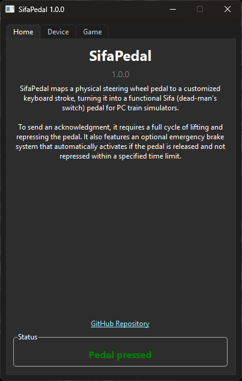
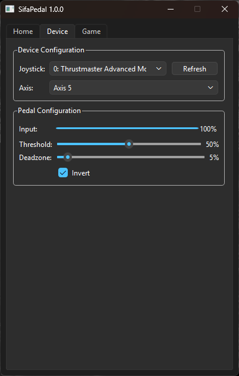
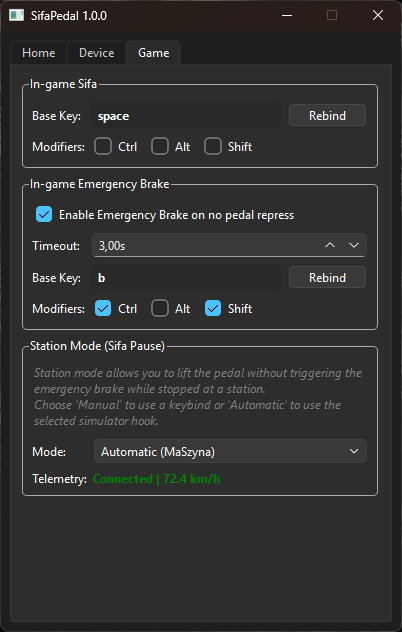

{ width="200" }
{ width="200" }
{ width="200" }

# SifaPedal

SifaPedal maps a physical steering wheel pedal to a customized keyboard stroke, turning it into a functional Sifa (dead-man's switch) pedal for PC train simulators. To send an acknowledgment, it requires a full cycle of lifting and repressing the pedal, accurately mimicking real-world Sifa mechanics. Additionally, it features an optional emergency brake system that automatically activates if the pedal is released and not repressed within a specified time limit.

## Download

-   **Portable Executable**

    A standalone executable file. It requires no installation. Just download it and run it directly from any folder on your computer. Ideal for quick setups without modifying your system.

     

    [Download Portable](https://github.com/kacper-jar/SifaPedal/releases/latest/download/SifaPedal-portable.exe){ .md-button .md-button--primary style="display: block; width: 100%; box-sizing: border-box; text-align: center;" }

-   **Installer**

    A standard setup wizard that will install SifaPedal on your system, create necessary shortcuts and provide a convenient uninstaller. Recommended for permanent setups.
    
     
    
    [Download Installer](https://github.com/kacper-jar/SifaPedal/releases/latest/download/SifaPedal-setup.exe){ .md-button .md-button--primary style="display: block; width: 100%; box-sizing: border-box; text-align: center;" }

[Browse releases](https://github.com/kacper-jar/SifaPedal/releases/){ .md-button }

## How to use

### Setup

1. **Open SifaPedal**
2. **Device Configuration**: Navigate to the **Device** tab.
    - Select your steering wheel or pedal device from the **Joystick** dropdown.
    - Select the correct pedal axis from the **Axis** dropdown.
    - Use the **Input** progress bar to test your pedal. Adjust the **Threshold** and **Deadzone** sliders to your preference. If the axis behaves backwards, check the **Invert** box.
2. **Game Configuration**: Navigate to the **Game** tab.
    - **In-game Sifa**: Click **Rebind** to set the base key and select any modifiers (Ctrl, Alt, Shift) that correspond to your simulator's Sifa acknowledgment key.
    - **In-game Emergency Brake** *(Optional)*: Enable this to automatically trigger an emergency brake if the pedal is released for too long. Set the timeout (in seconds) and rebind the emergency brake key to match your simulator.
    - **Station Mode (Sifa Pause)** *(Optional)*: Station mode pauses the Sifa system so you can lift your foot while stopped at a station. Choose **Manual** to toggle it with a specific key or **Automatic** to have it automatically pause when your train's speed drops below 0.5 km/h (Currently, only MaSzyna is supported for automatic station mode).

### In-game Usage

- **Acknowledging Sifa**: To send a Sifa acknowledgment, you must perform a full cycle: lift your foot off the pedal, and then repress it.
- **Pedal States**: You can monitor the current state in the **Home** tab:
    - **Pedal pressed**: Your foot is on the pedal.
    - **Waiting for repress**: You have lifted your foot. You must repress the pedal to acknowledge.
    - **Sifa acknowledged**: The keystroke has been sent to the simulator.
    - **Emergency brake applied**: If enabled, this state triggers when you fail to repress the pedal within the specified timeout, sending the emergency brake keystroke to the simulator.
    - **Paused (Station Mode)**: The Sifa system is temporarily paused.

---

### Made with ❤️ by Kacper Jarosławski

[:octicons-link-16: Website](https://kzl21.ovh){ .md-button style="margin-right: 10px;" }
[:octicons-mark-github-16: GitHub](https://github.com/kacper-jar){ .md-button }

