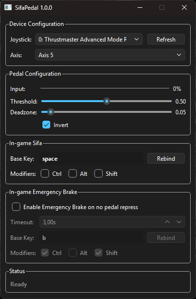

{ width="200" }

# SifaPedal

SifaPedal maps a physical steering wheel pedal to a customized keyboard stroke, turning it into a functional Sifa (dead-man's switch) pedal for PC train simulators. To send an acknowledgment, it requires a full cycle of lifting and repressing the pedal, accurately mimicking real-world Sifa mechanics. Additionally, it features an optional emergency brake system that automatically activates if the pedal is released and not repressed within a specified time limit.

## Download

-   **Portable Executable**

    A standalone executable file. It requires no installation. Just download it and run it directly from any folder on your computer. Ideal for quick setups without modifying your system.

     

    [Download Portable](https://github.com/kacper-jar/SifaPedal/releases/latest/download/SifaPedal-portable.exe){ .md-button .md-button--primary style="display: block; width: 100%; box-sizing: border-box; text-align: center;" }

-   **Installer**

    A standard setup wizard that will install SifaPedal on your system, create necessary shortcuts and provide a convenient uninstaller. Recommended for permanent setups.
    
     
    
    [Download Installer](https://github.com/kacper-jar/SifaPedal/releases/latest/download/SifaPedal-setup.exe){ .md-button .md-button--primary style="display: block; width: 100%; box-sizing: border-box; text-align: center;" }

## How to use

1. to be written

---

### Made with ❤️ by Kacper Jarosławski

[:octicons-link-16: Website](https://kzl21.ovh){ .md-button style="margin-right: 10px;" }
[:octicons-mark-github-16: GitHub](https://github.com/kacper-jar){ .md-button }

